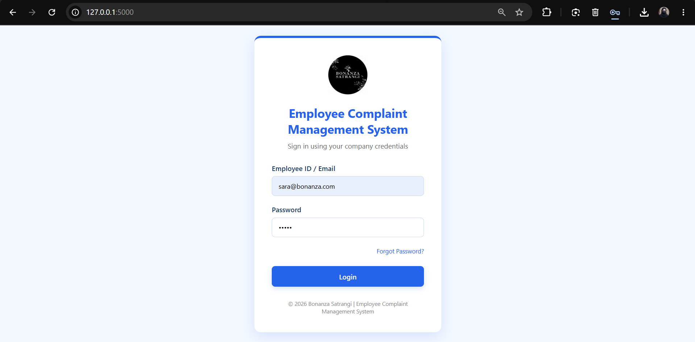
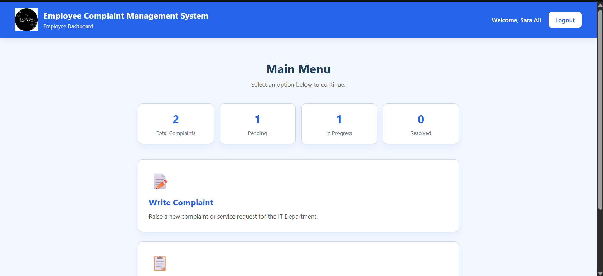
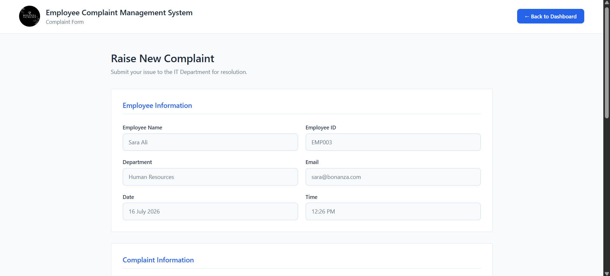
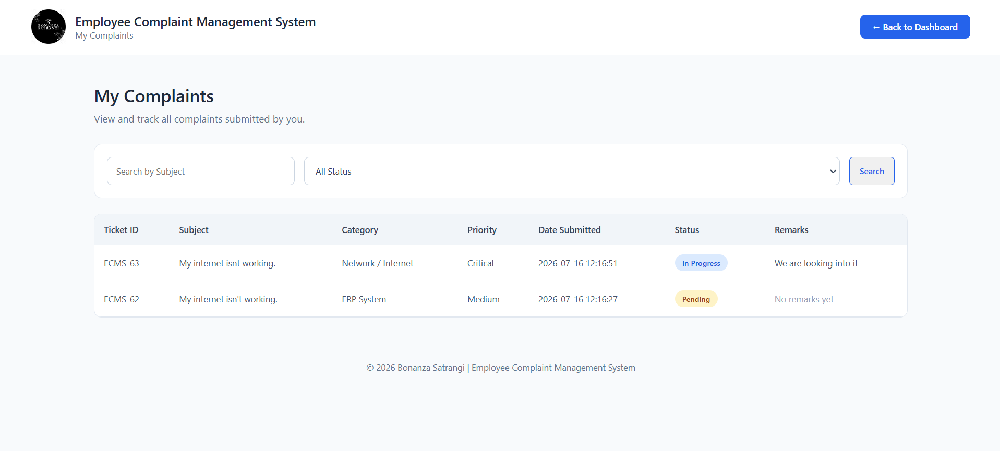
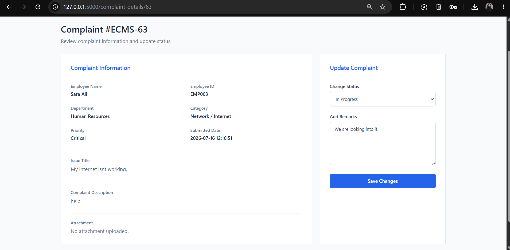
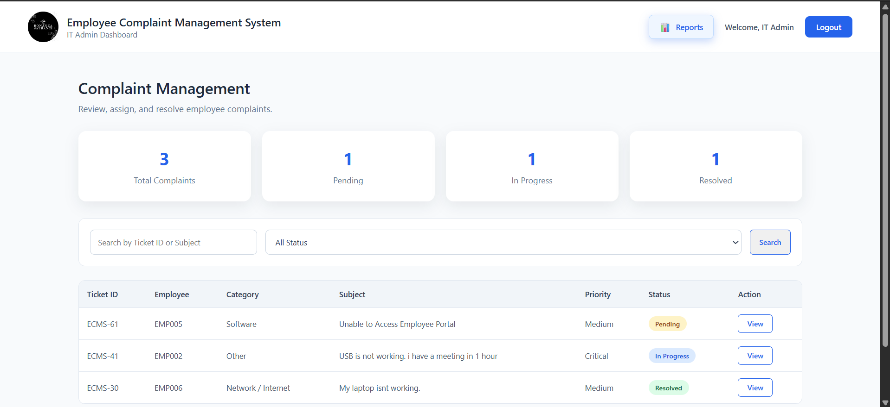
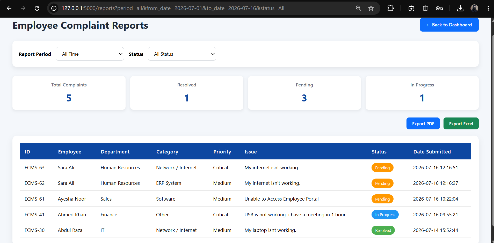

# Employee Complaint Management System

[](https://www.python.org/)
[](https://flask.palletsprojects.com/)
[](https://www.oracle.com/database/)
[](#license)
[](#employee-complaint-management-system)

An internal complaint tracking platform built for Bonanza Satrangi to help employees submit issues, track complaint status, and let the IT/admin team review, manage, and export reports from a single system.

## Table of Contents
- [Overview](#overview)
- [Features](#features)
- [Tech Stack](#tech-stack)
- [Project Structure](#project-structure)
- [Screenshots](#screenshots)
- [Prerequisites](#prerequisites)
- [Installation](#installation)
- [Database Setup](#database-setup)
- [Running the Application](#running-the-application)
- [Login Credentials](#login-credentials)
- [How to Use](#how-to-use)
- [Configuration Notes](#configuration-notes)
- [License](#license)
- [Contact](#contact)

## Overview
This project is a Flask-based Employee Complaint Management System backed by an Oracle database. It supports employee login, complaint submission with attachments, status tracking, an IT/admin dashboard, and reporting with PDF and Excel export options.

The system is designed for company use, so access and redistribution should be controlled according to internal approval and permission requirements.

## Features
- Secure login with role-based access for employees and admin users.
- Employee dashboard with complaint statistics.
- Complaint submission form with category, priority, store location, device details, and file attachments.
- Complaint history page with search and status filtering.
- IT/admin dashboard for viewing and managing complaints.
- Reports page with time filters such as today, yesterday, last 7 days, this month, last month, this year, last year, and custom date ranges.
- Export reports to PDF and Excel.
- Oracle database integration for storing employees, departments, and complaints.
- Clean HTML/CSS templates for user-facing screens.

## Tech Stack
- Python
- Flask
- Oracle Database
- oracledb
- openpyxl
- ReportLab
- HTML, CSS, and Jinja2 templates

## Project Structure
```text
Employee Complaint Management System/
├── app.py
├── ECMS.sql
├── README.md
├── database/
│   └── db.py
├── static/
│   ├── css/
│   ├── images/
│   └── uploads/
└── templates/
	 ├── complaint_details.html
	 ├── complaint_form.html
	 ├── complaint_success.html
	 ├── employee_dashboard.html
	 ├── it_dashboard.html
	 ├── it_support.html
	 ├── login.html
	 ├── my_complaints.html
	 └── reports.html
```

## Screenshots
No live demo is available yet.

#### Login Page

#### Employee Dashboard

#### Complaint Form

#### Track Complaint

#### Complaint Details

#### IT Dashboard

#### Report


## Prerequisites
- Python 3.10 or newer.
- Oracle Database XE or another Oracle instance.
- Oracle client support compatible with the `oracledb` package.
- `pip` for installing Python dependencies.

## Installation
1. Clone the repository:

	```bash
	git clone https://github.com/Realmaryambano/Employee-Complaint-Management-System.git
	cd Employee-Complaint-Management-System
	```

2. Create and activate a virtual environment:

	```bash
	python -m venv venv
	venv\Scripts\activate
	```

3. Install the required Python packages:

	```bash
	pip install flask oracledb openpyxl reportlab werkzeug
	```

## Database Setup
1. Open `ECMS.sql` in Oracle SQL Developer, SQL*Plus, or your preferred Oracle tool.
2. Run the script to create the `Departments`, `Employees`, and `Complaints` tables.
3. The script also inserts sample department and employee data for testing.
4. If you want to use your own Oracle schema or credentials, update the connection details in `database/db.py` before running the application.

## Running the Application
1. Make sure your Oracle database is running.
2. Confirm the database schema has been created by running `ECMS.sql`.
3. Start the Flask application:

	```bash
	python app.py
	```

4. Open the app in your browser:

	```text
	http://127.0.0.1:5000
	```

## Login Credentials
Sample credentials are included in `ECMS.sql` for local testing.

- Employee account
  - Email: employee@bonanza.com
  - Password: 12345

- Admin account
  - Email: admin@bonanza.com
  - Password: admin123

## How to Use
### Employee flow
1. Log in with an employee account.
2. Review your dashboard to see complaint counts by status.
3. Submit a new complaint from the complaint form.
4. Track submitted complaints from the My Complaints page.
5. Use search and status filters to find a complaint quickly.

### Admin / IT flow
1. Log in with the admin account.
2. Review complaint totals and current status summaries.
3. Filter complaints by complaint ID, title, or status.
4. Open the reports page to analyze complaint data by time period.
5. Export reports to PDF or Excel for sharing and archival.

## Configuration Notes
- The Oracle connection settings are currently stored in `database/db.py`.
- The app uses `static/uploads` for uploaded attachments.
- Keep the upload folder available and writable by the application.
- If you change the port or host, update the run instructions accordingly.
- Before production use, replace any test credentials and hardcoded secrets with secure environment-based configuration.

## License
This project is proprietary and confidential.

Copyright (c) 2026 Maryam Bano and Bonanza Satrangi.

All rights reserved.

Use, copying, modification, redistribution, or deployment of this software is permitted only with prior written permission from Maryam Bano and Bonanza Satrangi, or by an authorized representative of the company.

For permissions or internal use approval, contact:

- Name: Maryam Bano
- Email: maryambano.official@gmail.com
- LinkedIn: https://www.linkedin.com/in/realmaryambano/

## Contact
- Name: Maryam Bano
- Email: maryambano.official@gmail.com
- LinkedIn: https://www.linkedin.com/in/realmaryambano/
- GitHub Repository: https://github.com/Realmaryambano/Employee-Complaint-Management-System

